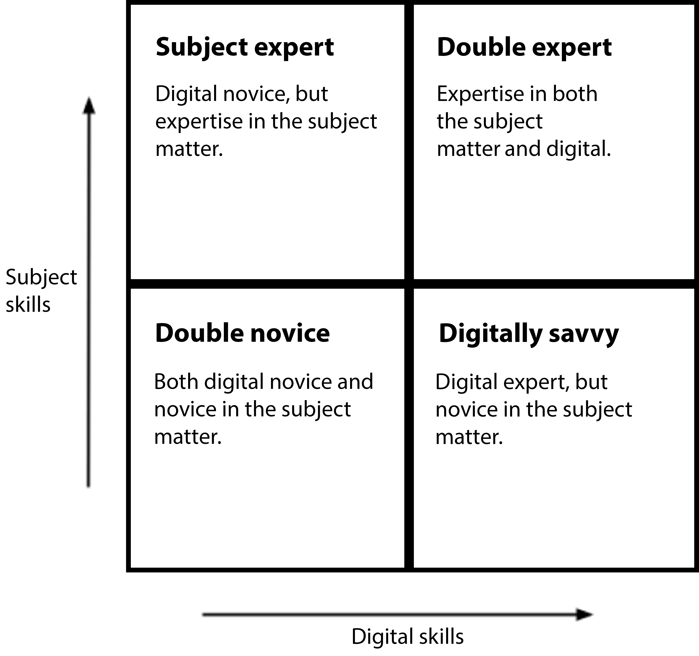

# Strategy for Enterprise Search
## Executive summary
This is a summary of Region Västra Götaland’s strategy for enterprise search. Discussing the overall points for orientation of the strategy’s contents and be able to take a decision on its establishment.

### Vision and mission statement
The vision is that search "will deliver the right information when it is needed." Not necessarily is the user forced to seek to find, but also to receive feeds and be notified if anything of importance occurs. The information need to become more intelligent. The business goal for search  is primarily to avoid the risk of someone acting on outdated knowledge. Secondarily to offer a complete picture to the information, not to unnecessarily develop or purchase information or things that already exists somewhere within the organisation. We should strive to make the benefits of search known and the platform well-used to realise these goals.

### Application requirements and usability
We will focus on user experience and work user-oriented. This is because  search is there to help finding information and knowledge - even when there to the user’s not obvious where to find it, or that it exists. Two fundamental challenges to adhere to is that users have varying digital maturity and varying expertise in the material they are seeking. Therefore, search has to take advantage of both the novice and the expert way to express themselves, but also support the usage pattern that distinguishes the digital novice from the digital savvy. Search has to live up to high standards of accessibility and usability, both from a desktop computer and a more mobile scenario.

### Management and organisation
Search should be continuously improved. By reflecting on operational goals, feedback from the users as well as by insights gained working with search analytics. In addition, the organisation shall have annual priorities of the activities to be carried out and follow up on the efforts made. The organisation intends to gradually move towards a more structured information architecture which naturally affects the curation of information sources. Also, it is important to provide opportunities for personalised search results, which, when appropriate, is also displaying access-restricted material.

## The search strategy
### About the strategy
This is a strategy for organisational search technology, commonly referred to as Enterprise Search. That is, the tools and systems that work together to search the organisation's own information sources, while external sources can and should be searchable in a well-functioning internal search platform.

### Vision
> "Get the right information when it is needed."  

* “Get” means that the information reaches the user automatically through feeds, notifications or through manual search.
* With the "right information" the accuracy, validity and relevancy is implied.
* By "when it is needed" we pinpoint that the information reaches the user in the context the user is currently at and with the tools that are available (PC, mobile, etc.)

### Business goals
The primary business case for an organisation's internal search is to help with finding information and knowledge when there is not obvious to the user where to find it, or that it exists in the first place.

Search is the tool that is offered when editorial priority or lists of content does not solve the user's specific problem. Since search has a unique overview of multiple sources of information it can also be used to convey information between different information systems.

Reasons why it is difficult to recoup investment in search mainly revolves around that its usage is seldom part of a controlled business process. Even if were, the primary metric is time saved. Time saved is not a particularly good indicator of success. In other words, it is difficult to develop Key Performance Indicators (KPI) that define the success of search.

Industry expertise highlights that the success factors for search is to avoid risks, such as the risk that someone is acting on outdated knowledge. This can be measured quantitatively.

Another example of business goal is to look historically what opportunities were not exploited fully because of inadequate information. Such can occur during major changes in the business environment or internal reorganisation. This can be measured qualitatively.

**In other words, it is not enough that there is an enterprise-wide search. It must be known among those who need it but also perform well for those who choose to use it.**

Common business goals for search is to simplify access to information from known sources. For instance by increasing the reuse of information and knowledge, and to enable collaboration by making it easy to find colleagues with relevant knowledge.

Enterprise search has to bring operational benefits in the following scenarios:
1. A user on a website performs a site search, hoping to find specific information.
2. An employee is searching in what is perceived as the organisation's intranet, ie targeted information, published documents, etc.
3. A user need an overview of what multiple sources of information contains on a certain topic, the sources may be both internal to the organisation and  external provided by its partners.
4. When a specific application's internal search is not efficient, the organisation's strategic search platform should to take its place.
5. When information systems need access to content already in search’s index. This might happen because it may be better structured than the original source.

### Strive for consistency
A big advantage with enterprise search occurs when it is established, well known and have few competitors for the attention of the users. It is common to strive to replace accompanying search features of business applications. Examples of such can be document management systems, project management, intranets, and many more applications which main focus is not the information’s findability.

A pre-condition is that the enterprise search performs at least as well as the individual application’s inherent search it intends to replace. The feature refers not only to the user interface, but also how search is managed. For instance, if someone evaluates zero results, common search queries, what is actually clicked, etc.

In a large organisation, enterprise search need to comply with the search conventions  users have already learnt, but perhaps also establish an complementary internal convention. It is important that the user interface for search is consistently designed, peculiar relevance or a user experience that is puzzling. At the same time, you need to offer a logical autonomy for the divisions of the business that has a good reason to differ. If there are good reasons to deviate, those need be considered wisely to not lose the big picture.
In other words, there are a number of inherent requirements for subsequent  search capabilities, whether it is a new or specialised application based on the existing search platform or an entirely different search engine. Whether or not we complement our common search platform, the basic requirements are at least to be:

1. **Collecting usage data** comparable and compatible with the common search’s insights. Otherwise, one cannot conduct enterprise-wide search analytics and will little by little make search less impactful.
2. **Adhere to the organisation's design-conventions for search.** Consider design patterns such as the aesthetics of query-completion and its behaviour to the color the search button has. The point is recognition, of the visual and functional. A user is not supposed to ponder who the sender is.

### Requirements regarding usage
Search ought to be the primary option, regardless of whether the user is an expert or novice in the she’s looking for, whether the user is digital native or not.

Search must be responsive towards integration with other information systems that follows pragmatic standards, in order to support other systems that themselves is not capable of great search functionality.

To describe the users of search we can divide them into four principal groups - in a quadrant. Describing how familiar they are in the subject matter they are seeking, and how much experience they have of the opportunities digital technology offers.

The quadrant is inspired by the book [Designing the Search Experience](http://designingthesearchexperience.com/) .

Search has to consider the _double novice’s_ needs but also offer the efficiency _double experts_ expect without worsen the double novice’s  experience. To the greatest extent possible, avoid creating new specialised search interfaces in order to not cause confusion among users about “which search engine" to use when.

Examples of characteristics that distinguish subject matter experts and novices is what words they use when searching. The expert believes that they know what something is called and may have difficulty using layman's terms. This behaviour requires that the terminology is supporting both the expert and the layman's way of expressing themselves.

Examples of things that differ users based on their digital maturity is that the expert can take advantage of advanced tricks she has learned from other technical environments. For example, to use complex search queries or actively control acceptable misspelling. The novice’s needs rather are met with a introductory and educational way in which she is not caught off guard by too many possibilities at once, rather, she get contextual tips when they are meaningful and the benefits are obvious.

### Four modes when searching for information
1. **Known knowledge**. To search for already known knowledge is easy to understand, because the user:
	* Know what they want.
	* Can express what they want.
	* Have an idea of ​​where to start looking
2. **Exploring**. When in this mode, the user has an idea of ​​what it want to know. But the user may have difficulty expressing it, or cannot use the correct terms. The user often know when it has found the right content, but has no knowledge if the amount of information is sufficient.
3. **Do not know what they need**. The key concept behind this condition is that users often do not know exactly what they need to know. They may believe that they need to know one thing, when in reality it is something else. Sometimes, they visit an information source without any specific purpose.
4. **Retrieve**. In this mode, the user is looking for information that it has prior knowledge of. They can remember where they saw it recently, which source of information it were or they have an idea where to find the content.

Some common use cases for enterprise search is to:
* Find a specific document.
* Finding specific skills / roles / persons.
* Quickly become an expert on a topic-
* Find out everything that the organisation knows about a topic-

### Usability and accessibility
To ensure good accessibility and usability search’s user interfaces has to be developed in accordance to the accessibility guideline WCAG 2.0 at least at level AA. In addition to this, user interfaces should at the very least comply with priority 1 of webbriktlinjer.se and never deliberately deviate from their guidelines of secondary priority.

Design principle to adhere to is **mobile first** since those connecting with a mobile device should not have a worse experience.

In most cases, when search highlights or present structured data it shall also, technically, be disclosed in a structured manner. Such as described by schema.org, where content is marked up with the appropriate level of structure.

Extremely good performance must be delivered to the user. Measured according to Google Pagespeed ​​Insights, from a mobile user scenario, never less than 80 / 100, as well as for desktop computers never below 85 / 100, unless stricter requirements exists within the organisation.

### Management and governance
The management of search is important and since it’s often regarded as both everyone's and no one's concern it’s not easy to manage. Managing search requires a range of skills which does not make things easier. Here are the most strategically important to partake in the management.

#### Key figures
The groups identified below are those that have the greatest impact on search’s continuous management and development to provide the conditions for good business and user benefits.

#### Those who budget
A search platform need ongoing development and adjustments to deliver what users expect. To constantly develop to meet the changing user needs requires that resources are allocated accordingly.

#### Content creators
Everyone that may affect the searchable content are within the primary group interest. The most easily identified group is the web editors, working with content on the intranet and external websites.

Another such group is people who produce documents, such as word processing, spreadsheets or presentations. Documents are often searchable either from the website's upload folder or document management system indexed by the search platform.

This group of key people need to have an understanding of how the results of their work affects how search is either successful or failing.

#### Content curators
Search is in great need of an orderly process for informatics in the organisation. The reason for this is that search is user-driven. Because the users themselves are phrasing their search queries in hope that it will deliver good results. 

Search is dependent on us working with informatics - at least to some extent - for subject matter experts to use their terminology, without excluding the related information created by the laity, and vice versa.

#### Those who support the search platform
To not be reckless on technology-driven initiatives, a business representative (business owner of search) is to control the activity plan and its priorities yearly. Connecting the activity plan, budget and the quality of delivery to the business. It should be clear what benefits were gained.

This action plan should then be monitored and events are regularly reported to the business owner of search.

Those working as search editors need acceptance from line managers for their work with editorial tasks - manually controlling the results, deciding on keymatches, improving important metadata on others’ content, working with search’s instructional texts, and more.

It has been shown in studies that search is more appreciated if there is someone responding to user questions and managing feedback channels. This need to be formalised so users are receiving help or feedback in a reasonable time.

To have a good technical availability we need a dedicated technical support and an active IT operations, also that servers work satisfactorily.

### Organisation

The most important effort an organisation can do to improve its search  is to appoint a _owner of search_! It is an absolute minimum requirement.

This means that a owner of search must have time set aside to work with search. A few hours a week is much better than nothing. And even more important: to work with search is a long-term work, certainly not a project.

The roles and competencies in search’s management should consist of:

* (Business) owner of search
* Search technician
* Search editor and/or Information specialist
* Search analyst
* Search support

Further reading: [Enterprise Search Team Management](http://www.intranetfocus.com/wp-content/uploads/Enterprise-Search-Team-Management.pdf) by Martin White.

### Evaluation of search
Search fill its purpose when it deliver the right information, is fast about it and always available. To satisfy these requirements, the function of search is to be tested regularly and tests should be documented in test plans. Below are some of the tests that are appropriate:

* Search loads quickly, tested with [Google Pagespeed Insights](https://developers.google.com/speed/pagespeed/insights/), with a minimum of 80/100.
* The response time of a query should be about 0.1 seconds, but never longer than 1 second, measured at the user interface.
* Search will be available 24/7 (around the clock seven days a week). Monitored by, for instance, [Pingdom](https://www.pingdom.com/) or [Uptimerobot](http://uptimerobot.com/).
* Size of search indexes. Among other things, to see if more or fewer documents are indexed, which can provide warning signs in advance, help being proactive.
* Search’s user interfaces are accessible, tested with the [W3C Validator](http://validator.w3.org/). 
* Search’s user interfaces are usable, tested against webbriktlinjer.se and [W3C:s WCAG 2.0 at level AA](https://www.w3.org/WAI/WCAG20/quickref/).
* Survey the satisfaction of users.
* Reviewing search statistics and/or performing search analytics, to gain insight into how users are searching.

### Search analytics
Search statistics must be collected and need to be continuously analysed to find out what works and what does not. Search analytics is used to improve search results. At the very least, frequently analyse zero-results and the two hundred most common search phrases.

By analysing the search queries that did not give any result at all (zero results) it is possible to identify what content is missing, find synonyms to use, understand which abbreviations are used and discover alternative spellings.

The two hundred most common search queries need to continually be reviewed, probably manually, to get an insight into how the experience of  search is for a large part of the users. And also, if the relevance model can be improved and what content is most in demand.

### Helpdesk and support
User support (1st and 2nd line support) should be handled directly by the search editor(s) and the owner of search. The reason for this is to give the search management direct contact with users and thereby gain a better understanding of what works and what does not. Users should be able to directly report their perceived problems with search in general and search results through a feedback form in connection with the search interface.

The technical support is handled like any other system.

#### Training
Probably everyone who use search are in need of some form of training in the offered features. At least the following user training needs to be actively disseminated and be available when needed:

* **All users** need to understand how search works and be able to supplement their knowledge with new handy tricks. An educational approach is to let users be activated by taking advantage of a interactive guide, where they "practice" their new skills while they seek. This interactive help in the search interface can be supplemented with links to more extensive documentation in the form of text, audio or video, for those interested.
* **Content creators** need to understand how they markup the information properly. It is worth to introduce an organisational quality quota regarding metadata which at least would be mandatory for professional content creators and communication professionals. In addition to this, the search technology ought to make it easier to get feedback on content’s potential findability directly when saving it - regardless of which system the creator is using.

Advantageously, a large part of the training content and documentation is available on the intranet. Also, use screen recordings to display operations that involves several interactions.

#### Search workshop - assistance on the user’s own premises
Search workshops should be organised regularly, a meetup where both content creators and users can met to get help and learn more about search. A search workshop can be held in a conference room, an afternoon a month.

In addition to attend this meetup, it should at the same time, for the convenience, also be possible to participate remotely. With screen sharing, voice calls or chats, remote user's should be offered a similar support.

### Information
The most important for a properly functioning search is the quality of  information indexed and that the organisation has a good information hygiene. Good information hygiene pinpoints that old and out of date information is regularly culled following established procedures. The procedure is the lifecycle management of information, sometimes referred to as “the content strategy”. In public organisations the lifecycle / strategy is often documented in a so-called document management plan.

The paradox of search is that large amounts of information potentially offers great business benefits, but also hampers the ability for search to be precise - to find the right information.

Lifecycle management of information is very important for good findability. A prerequisite for findability is to avoid ROT, that is, content that is  **R**edundant, **O**utdated or **T**rivial.

In practice this means that information available need to be evaluated in accordance with established principles, which can be summarised in the question: _Should the information be archived, deleted or updated?_

By categorising all the information it’s easier to decide how information should be handled. Categorisation is dictating the information’s lifetime. A guideline may be considered valid for 10 years, while a press release is archived in six months. Event and other time-based content can be archived after it occurred, and so on.

To get an overview of the sources that are important for the organisation to be searchable, a list of sources need to be compiled and maintained. The list should contain the already indexed sources, and also a priority of the sources of information to be indexed in the future.

#### Metadata and thesaurus
As part of a successful information management, there must be a list of the organisation's common concepts and terms. A common ground on terms contribute to good findability. This is called different things, depending on how far the work has progressed: glossary, vocabulary, nomenclature, terminology, taxonomy or thesaurus. These concepts must be documented, made available and used by all sources of information in the organisation.

#### Metadata
By establishing a specification for metadata, both categorisation and use of a common terminology is facilitated. If categorisation and annotation of information is consistent across all information sources indexing becomes easier and findability is improved greatly. The use of metadata ensures good findability. It is advised to require a minimum of metadata in each source of information, for example the following metadata for each document / page / information service:
* A title.
* Description of the contents.
* A number of descriptive keywords.
* Some timestamps, highlighting the content's lifecycle, such as when it was created, published, updated, revised and finally possibly archived.
* Status of availability. For example, if it is public, access-controlled, valid,  outdated, archived, etc.
* Its canonical address. That is the original and primary URL. A so-called [Canonical URL](https://support.google.com/webmasters/answer/139066?hl=en) .

By using the schema.org specification and similar standards, metadata requirements can be met.

#### Design
Design is important. Especially today, when most people refer to Google as their point of reference when it comes to how a search should look and behave. It is important that search behaves similarly to established design conventions - for the convenience and efficiency of users who have already learned certain skills to get the job done. Of course, search’s design patterns and design principles cannot differ from users' preconceptions. The most important thing is that the search function design provides value for the users and business.

When some change affects search’s design, a usability professional have the final say in how the design will end up.

[Example of a design prototype created for VGR](https://github.com/Vastra-Gotalandsregionen/Enterprise-Search/blob/master/img/sok-start.png), [person-specific search](https://github.com/Vastra-Gotalandsregionen/Enterprise-Search/blob/master/img/person-search.png) , [a keymatch](https://github.com/Vastra-Gotalandsregionen/Enterprise-Search/blob/master/img/keymatch.png) and [the wizard to introduce the new search-GUI](https://github.com/Vastra-Gotalandsregionen/Enterprise-Search/blob/master/img/guide.png) .

### Technology
The infrastructure of search should be handled by the organisation and is one of the organisation’s strategic services.

The technical platform for search is a very important part of a well-functioning search. It should be emphasized that all the technical platforms for search (commonly referred to as “search engines”) that is currently on the market are good enough for most of us. The choice of platform(s) of search is an important strategic one. The choice should reasonably be affected by economic, technical and operating concerns.

The technical infrastructure of search cannot only consist of a search platform, but also a well-functioning integration of supporting services, at least:

* **Centralized metadata management** that supports the users' language - whether it's layman terminology or not - to connect the expert’s terminology with the novice. In addition to this you need to manage the unstructured and more agile through an orderly folksonomy management -  possibly linking it to controlled vocabularies to bridge the gap between different users. The metadata management should also provide support to other information systems, or directly to the content creator, to provide up to date feedback on how findable the information will be once it is published.
* **Master Data Management (MDM), Product Information Management (PIM)** and **reference data** in order to identify the business’ physical and digital items from the abundance of information available in search.
* **Directories** to find people, traverse the structure of the organisation and other commonly used directories, both internal and external. Most obvious is that search should be able to compile a complete profile of every employee regardless of whether the complete picture is scattered in several specialised systems.

#### Collecting the information
When chosing a strategic platform for search, the range of data-connectors is one of the most important things to consider. The question to ask is: _is there connectors for the organisation's most important sources of information?_ The collection of information is resource intensive and to configure and develop custom connectors can be expensive, error-prone and difficult.

A connector’s purpose is to fetch (or receive) information from sources of interest for the search platform. Each connector is tailored to a specific type of information, such as databases (one connector for each different database type), file system, the Web, business applications, etc.

One method to gather information for the search index is for a crawler to visit the source of the information and see if anything has changed since the last visit. This is called crawling, a method of pulling content towards indexing. The disadvantage of this type of indexing is that it takes longer to notice recently created or updated information, making the search index less timely.

Another method of collecting information to search’s index is when the information source informs search when something have been changed or added. So-called push-driven indexing. The advantage of push indexing is that recent information quickly becomes searchable. It can be difficult to implement, though.

The perhaps most strategic solution is a combination of both push and pull. That information sources offers sitemaps, according the [sitemap protocol](http://www.sitemaps.org/). Search’s connector inspects the sitemap to determine what should be indexed, then the crawling connector does not need to visit all the information to find out if there is any new or modified.

#### Federated search - to search in several search applications simultaneously
The reason that not all information is searchable in a single search index is often about rights to source material, sometimes there are regulatory restrictions. For example, commercial journal repositories, research databases, etc. Another complication might be an individual user’s desktop search. With desktop search the material the user has stored locally on their machine, smartphone or whatever is perceived to be right by the user’s fingertips.

The search results of a federated search can be displayed in various ways. Often the results are displayed side by side, visualising that there are multiple repositories contributing.

Federated search is difficult to implement in a usable manner and the recommendation is to refrain for the time being, at least until very clearly business needs and goals allows for evaluating the potential benefits in an isolated pilot.

#### Security
Being able to search for access-controlled materials is important! There are two main principles for how search can make access-controlled materials presence known (for users without the necessary authorisation):

1. **The search result displays a content summary**, that is, a normal search result, even the restricted information, for all users. To access more than the summary, the user must provide the authorisation needed. If the user does not have access to the information, she’s granted no access. This is suitable for using search for exploration, to make users aware that there is information on the subject.
2. Search **only shows results that the user has access to** according to her authorisation. This is easier to implement.

No matter which of the principles chosen, the authorisation system should  be based on the same directory service controlling each and everyone’s authorisation. Also, the roles need to be described in the same way in all the information systems. The reason is that the documents have to be accompanied by an access control list (ACL) that controls who is granted access to the information. Otherwise, the access control is certainly complicated to implement.

If there is no common directory service, avoid indexing information that need access-control until the users’ permissions and roles are widely implemented.

## License - CC-BY-SA
This material has been produced by the Region Västra Götaland (VGR) in collaboration with several other public actors. It is not considered to be finished. We disseminate this information to interact with external stakeholders. The material is licensed under the [CC-BY-SA](https://creativecommons.org/licenses/by-sa/3.0/) , which among other things allows for further use.

Translation made by [Marcus Österberg](http://webbstrategiforalla.se/kontakt/).