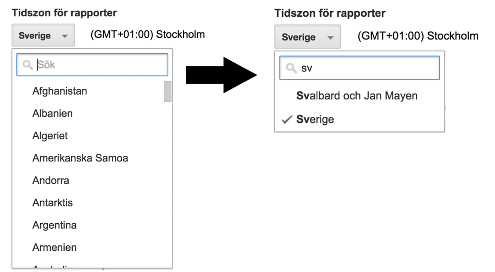
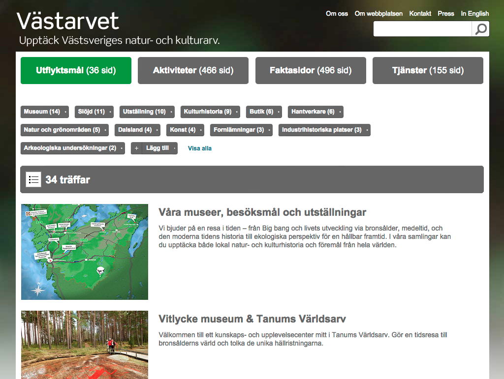
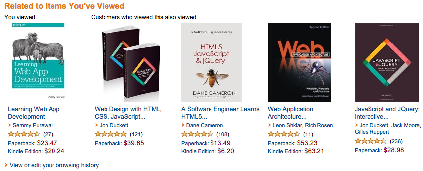
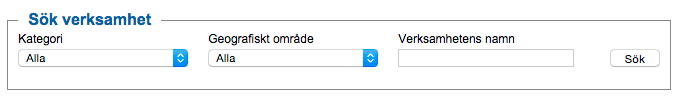
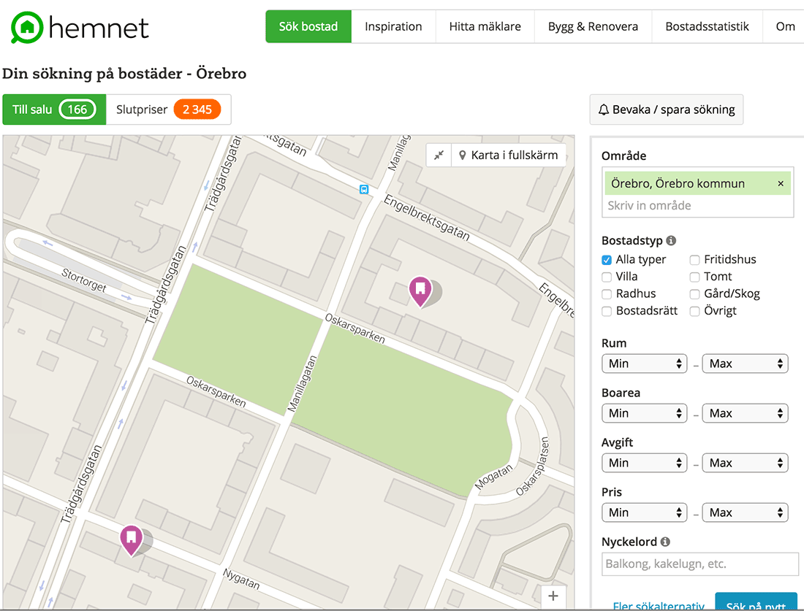
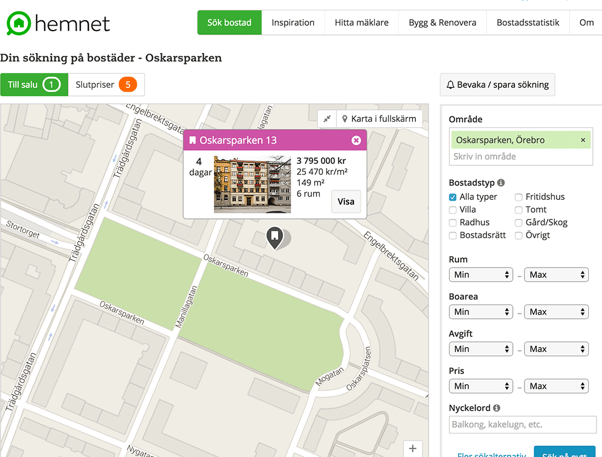
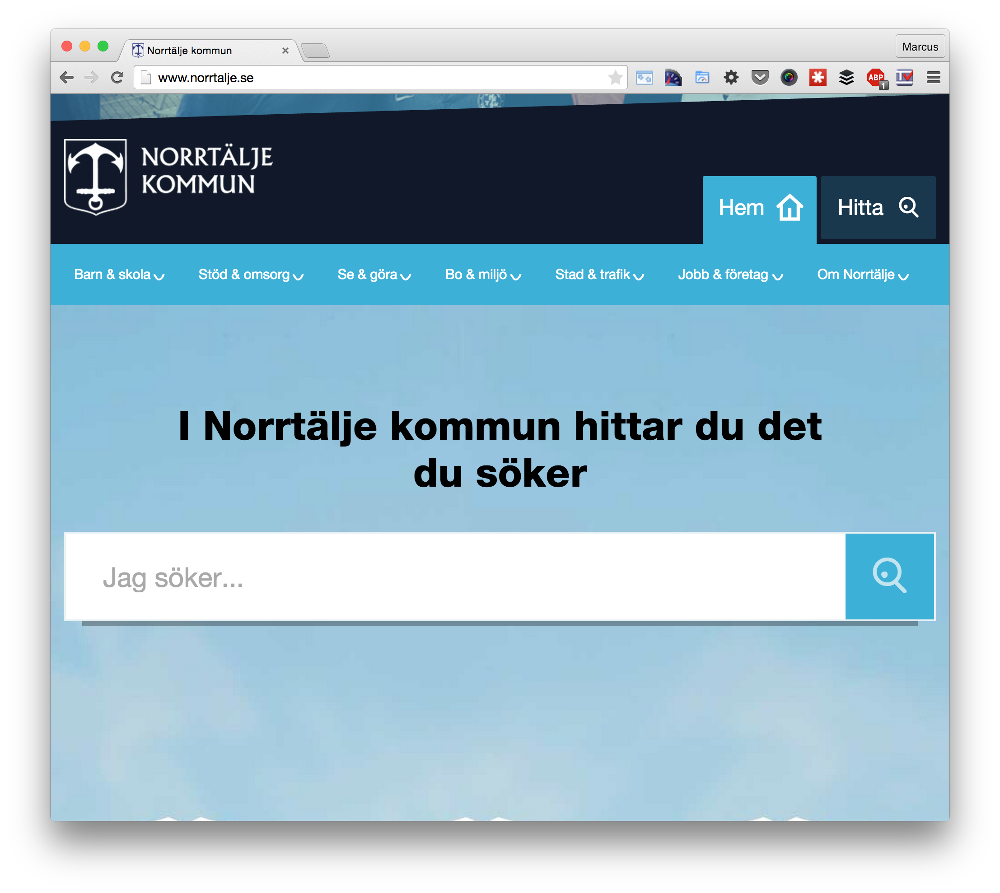
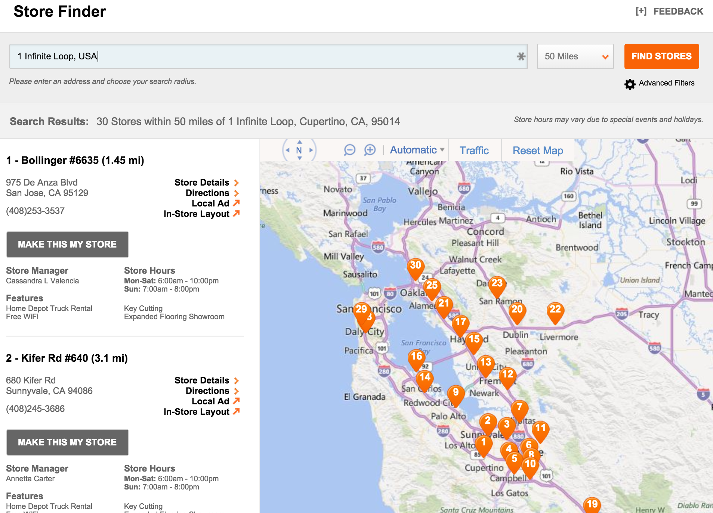
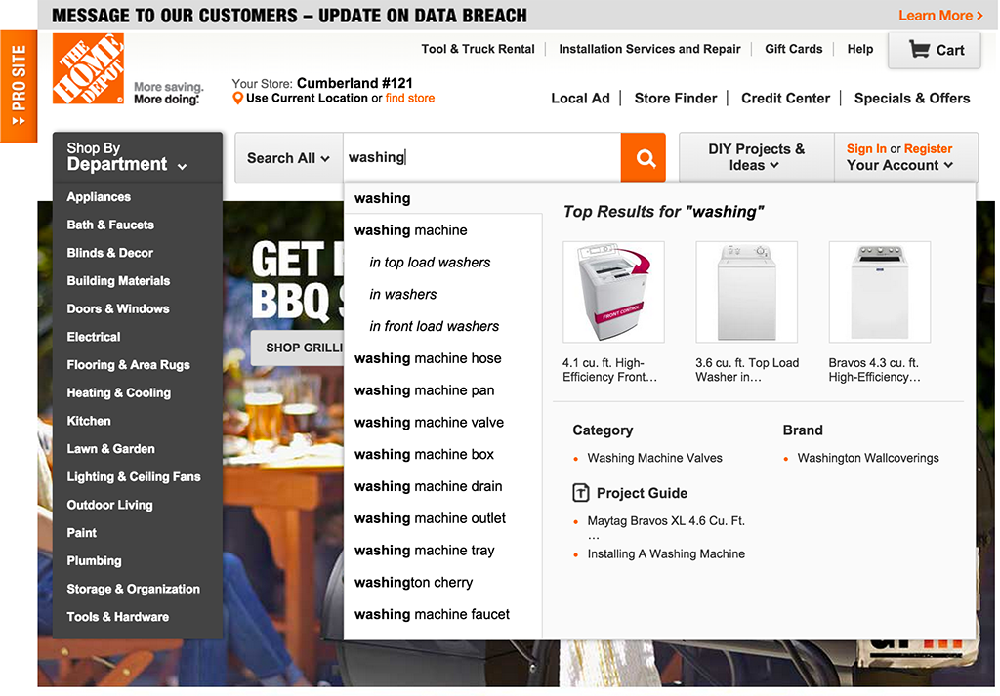
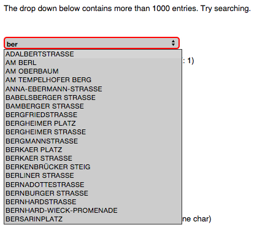

# Utredning sökdriven webbplats (version 0.9)

Notera att licensen är CC-BY-SA. De som gör väsentliga bidrag kommer att omnämnas när det är lämpligt. Läs mer om licensen och hitta exempel på tidigare öppen dokumentation på [https://github.com/Vastra-Gotalandsregionen/Enterprise-Search](https://github.com/Vastra-Gotalandsregionen/Enterprise-Search)

## Din sökfunktion kan inte jämföras med Google

> "Enterprise data simply isn’t like web or consumer data – it’s characterised by rarity and unconnectedness rather than popularity and context."  
> - [Charlie Hull, flax](http://www.flax.co.uk/blog/2012/10/25/the-death-of-enterprise-search-is-reported-again/)

## Bakgrund och problematisering
Att i mer eller mindre stor utsträckning använda sök som en naturlig del av sin webbplats är inte särskilt nytt, det har åtminstone varit ett synligt inslag på den svenska delen av webben de senaste fem åren. Sökteknik kan kännas väldigt lockande idag. Nu när allt fler är intresserade av uppföljning av innehållets effekt, lider av “the content explosion”, försöker lyfta fram innehåll som är relevant ur användarens unika sammanhang eller när man saknar motivation att manuellt ta hand om allt sitt äldre material. 

Frågan är om sök lever upp till den förhoppningen. Det är detta omfång denna utredning ska försöka ge lite svar på.

Exempel på problem verksamheter försökt lösa genom sökteknik är bland annat hur man skapar listor/navigering bland ett stort antal kontaktpunkter inom verksamheter. Exempelvis hur hundratals vårdmottagningar ska kunna navigeras utan att ha dem i en jättelång lista i en vanlig meny. Detta görs vanligen med mer eller mindre genomtänkta kombinationer av filtrering och sök - de ger ofta sken av att ha löst ett avsändarbehov då mångas design tyder på obefintliga användartester. 

En liknande utmaning är hur man hittar en lämplig kontaktperson, eller rätt kollega, i en större organisation. Här finns ofta fler än en intern källa med information som behöver sammanställas för att ge en komplett bild. Dessutom utan att man därmed tvingas göra manuell handpåläggning eller att informationen behöver kopieras (annars ruttnar informationen eller kräver massivt arbete för att hållas aktuellt). 

Många försök visar upp sökträffar på kartor som alternativt (och ibland primärt) gränssnitt. Dessvärre har ytterst få gjort detta på ett användarcentrerat sätt, vilket märks tydligt på vad inom geografi man får lov att söka på. Ännu ett sätt att presentera sökträffarna belastar användarna och lite diskret lämnar över problemet till dem. 

Ibland har de redaktionella prioriteringarna säkert fått styra och hela sökfunktionen visar upp sig i storlek som en lågt prioriterad reklambanner i ytterkanten på skärmen. 

Utredningen kommer inte ge svar kring informations livscykel, återanvändbarhet eller innehållskoreografi ur en informationsarkitekts synvinkel. Den är betydligt grundare än så och mer riktad till kommunikatörer och designers.

## Definitionen av “sökdriven webbplats”

Det finns konkurrerande definitioner, eller olika uppfattad innebörd av detta begrepp. Denna utrednings fokus är den fulla bredden men att ta upp exempel som pekar på söks roll som helhet snarare än vad som varit innehållet i olika leverantörers befintliga erbjudanden.

En grov kategorisering av olika sökdrivna webbplatser föreslås nedan.

### 1. För navigation och yta

Försöka ersätta navigation, hierarkiska menyer, dropdowns i formulär och så vidare med en sökruta. Att (nästan) allt ska sökas fram. En form av googlifiering av väl avgränsade delar eller rent utav hela webbplatsen. 

En ansats som kan vara lyckosam är att göra detta som en progressiv förbättring (se progressive enhancement inom begreppet webbstandard) det vill säga att man har en robust webbplats som fungerar i såväl gamla webbläsare som nya, med eller utan javascript eller andra tillägg. De tillägg man gör är för att förbättra användbarheten för de med nyare teknik utan att det går ut över tillgängligheten för någon med funktionsnedsättning. 

### 2. Sök som datakälla och publiceringssystem

En förhållningssätt som inkluderar allt sök kan erbjuda jämfört med ettan. Att använda sökplattformen med förinställda sökfrågor för att bygga upp en navigationsstruktur, eller sätta samman innehåll från olika datakällor till enskilda webbsidor. Här är sökfunktionen själva webbplatsen och det kanske inte ens finns redaktionellt innehåll, åtminstone så är det inte huvudnumret. 

Exempel på detta är [vastarvet.se](http://vastarvet.se) som är en renodlad sökwebbplats, även fast innehållet produceras i ett vanligt webbpubliceringssystem.

### 3. Öka relevansen genom personalisering

Att dra nytta av information om användaren och hennes sammanhang (exempelvis geografisk plats, uppgifter om beteende) och med detta försöka öka relevansen av det innehåll som lyfts fram. Här drar man främst nytta av söks kompetens inom relevansmodeller för att servera "rätt" innehåll till rätt ögon. 

Inom annonsering finns det snarlika konceptet med remarketing, att man lyfter fram något användaren visat intresse för men inte tycks ha fullföljt ett köp ännu. Motsvarande hos 

Amazon.com är att ge plats på sin webbplats för vad en användare tittat på och även att ge förslag på relaterat material. Sidan är med andra ord inte statisk, snarare är innehållet delvis styrt efter var och ens av användarnas unika beteende och surfhistorik.

Vill du läsa på mer om riskerna med att hitta falska sammanhang så kolla gärna in Karen McGranes bok [Content Strategy for Mobile](http://abookapart.com/products/content-strategy-for-mobile) bland annat.

## Förutsättningar för sökdrivet

För att det ska vara lönt att ta sig an sökdriven webb bör en innehållsstrategi vara på sin plats och etablerad. Det innehåll som sökmotorn behöver kunna presentera behöver leva upp till "adaptive content" - det vill säga oerhört mycket mer mångsidigt än det du producerar med hjälp av kontorsprogram som Word eller de PDF-filer du kanske är van att publicera. 

Det här handlar om metadata ner på lägre nivå än det vi på webben klumpar samman som sidor. Innehållsstrategin behöver gå mycket djupare än att tänka på sidor, man kan bland annat ta en titt på Brad Frosts koncept med atomic design - att en sida utgörs av fristående beståndsdelar, som kan ingå i ett flertal olika kombinationer. Varje beståndsdel måste märkas med all den metadata den behöver för att kunna verka i sammanhanget av helheten. För att inte uppfinna hjulet gång på gång behöver man följa etablerade standarder kring informations organisation och klassifikation. 

### Maskinläsbart = tillgängligt för en sökmotor

Webbtekniker som mikrodata, exempelvis RDFa, är ett gott exempel på hur delar av innehållet på en webbplats kan vara självbeskrivande. En kalenderhändelse kan alltså tala om _när_ den inträffar, _vem_ som arrangerar och _var_ någonstans. Kalenderhändelsen har i detta simpla exempel - som du kan läsa mellan raderna - en relation till en arrangör, och säkert en relation till en geografisk plats. Vem och var har egna sätt att återge självbeskrivande information, samt relationer, till andra ting. 

Utforska branschstandarden [schema.org](http://schema.org) så kan du se hur komplett och komplex en informationsmodell kan tänkas vara för att göra en sökmotor till viljes.

“Skit in, skit ut” gäller förstås även här. Sökmotorer är inte tillräckligt bra på att gissa, så man blir illa tvungen att vara väldigt precis med sin information och investera rätt mycket resurser i att få det att fungera tillfredsställande. 

Det är inte lönt att jobba med sökteknik om ens innehåll inte är välstrukturerat och maskinläsbart!

En av respondenterna till enkäten bakom denna utredning konstaterade att “det blev en arbetsuppgift för mycket” att förvänta sig att webbredaktörerna skulle skriva för att innehållet skulle kunna hittas. 

Har man inte möjligheten att förändra hur innehållet skapas och underhålls är det nog direkt olämpligt att ge sig på sökdriven webb. Då kan inte sök bli så bra att det är värt att tränga sig fram på en webbplats. Sök erbjuder varken magi eller genvägar, snarare pekar det i efterhand ut alla brister i innehållet.

### Ett ordnat innehållsarbete kan visa sig vara ett oväntat stort arbete

Man kan följa [NPR:s modell COPE (Create Once, Publish Everywhere)](http://www.slideshare.net/mobile/zachbrand/npr-api-create-once-publish-everywhere) för att se hur krävande ett ordnat innehållsarbete är idag. 

Exempel på frågor att ställa sig kan vara: kan bilden tala om att den inte borde visas i mobiler i porträttläge?

På detta område tycks många ha tagit genvägar oavsett om man jobbar sökdrivet eller med desktop/mobil/responsiv webb. Man accepterar det som erbjuds i det publiceringssystem man redan har. En nytillkommen vinkel på detta är att de klassiska CMS-leverantörerna bygger in sök i sina verktyg. Detta är säkert med förhoppningen att kunna fortsätta vara relevanta med traditionell redaktionell webbpublicering till egen webbplats - utan att glapp uppstår mot alla andra platser kunden vill få ut sitt innehåll, som sociala kanaler, appar samt personaliserade tips i utskick och vid inloggning. 

Dock behåller man mer eller mindre grundkravet att ens egen webbplats är det främsta målet. Om det inte vore så skulle man inte kunna med att paketera innehåll i HTML. En sökmotor är inte bra på HTML jämfört med andra mer precisa tekniker, som schema.org eller att man lär sin sök hur innehållets informationsmodell ser ut. 

Med andra ord är denna paketering av CMS och sök på inget sätt saliggörande, alldeles oavsett säljargument som "Enterprise grade search". Man säljer antagligen ett system för webbpublicering, inte fundamentet för ett mångsidigt innehållslager där innehållet självt kan tillfrågas om när det är användbart. 

Sökdriven webb är inte en enkel lösning på dessa utmaningar. Det gör inte befintligt innehåll bättre, lika lite som att ett responsivt webbprojekt gjorde innehållet bra i din telefon. Det kräver mycket jobb med att skapa ett mångsidigt innehåll. Innehållet behöver betraktas som en tjänst (content as a service) där man skapar det en gång men att det kan publiceras gång på gång efter respektive behov, sammanhang och förutsättningar. 

Få webbredaktörer av idag kan känna att de redan gör rätt. Hur bra fungerar ditt publiceringssystem med länkar mellan sidor när det inte är på webben materialet visas, exempelvis? 

Även om en webbplats är målet i denna utredning förutsätts nog att man som skapare har tagit en väl kalkylerad risk om man inte sätter upp en modern innehållsstrategi som täcker in mer än ens egen webbplats. Bara genom att förutsätta att man kan ha en HTML-länk mellan "sidor" introducerar man begränsningar för användning i miljöer där HTML inte är bra, vilket gäller sökmotorer, appar och mycket annat, samt att det i massiv skala är tydligt till vad och varför länken finns där.

I de fall man siktar mot sökdriven webb måste alla delar av innehållet vara så tydliga och självbeskrivande att de blir maskinläsbara i dess syfte, värde och sammanhang som dess plats i hierarki. 

## Naiv syn på sökdrivna webbplatsers koncept och design?

Att bygga sökdrivet betyder inte att du kan nöja dig med att erbjuda en fritextsök, träfflista och detaljsida. Användarna behöver oerhört mycket mer stöd än så även i den minsta tänkbara avgränsningen du vill använda sök till.

Bara för att nämna några saker behöver man ha mycket bra sökordsförslag, rättstavning, kunna söka på ords alla former och synonymer, vägleda till förfinade sökningar, sammanhangsanpassa innehållet etc.

En sökdriven webbplats måste underhållas löpande som en söktjänst. Exempelvis behöver man följa upp nollresultat och analysera sökord kontinuerligt.

  
Bildkommentar: Vanligt förekommande “sök” på webbplatser. Utan att ens ha skrivit in ett sökord finns 56 kombinationer av “Kategori” och “Geografiskt område”, vilket nästan garanterar att man inte får en träff. Det finns alltså fler kombinationsmöjligheter av filter än träffar i just denna sökfunktion.

Sökgränssnitt är mer interaktiva än en mer redaktionellt lagd webbplats och det ställer helt andra krav på tillgänglighet, genomtänkta flöden genom funktioner och alternativa sätt att presentera innehållet. Ska geografiska platser visas upp på karta? Som en lista? Finns plan på hur man lär användare att bli mer avancerade, genom spelmekanismer som lockar till lärande?

Ta hjälp av expertis inom användarupplevelsedesign innan du skickar uppdraget till utvecklarna!

## Argument för sökdrivna webbplatser

Förutsatt att man har gjort sin hemläxa med innehållets metadata och uppdelning kan en sökdriven webb fungera utmärkt och i vissa fall vara det enda logiska alternativet om mängden information är tillräckligt stor.

Sök kan vara det mest tillgängliga, användbara och uppskattade sättet som finns att erbjuda en digital tjänst. Väl utfört så blir det mycket tydligt att man som användare känner att **man har kontroll**, det **går fortare än att navigera** i stora mängder information och man kan lita på att det sök erbjuder är **sant och komplett**.

## Argument mot sökdrivna webbplatser
Precis som att man nu börjat lära sig att användare via en smartphone inte nödvändigtvis är en homogen grupp kommer man sannolikt nå insikt i förhastade slutsatser kring sök. Alla kontext kan inte lösas genom ett sökgränssnitt.  
Risken är att man drar på sig allt för frekventa nollresultat om det inte är uppenbart vad man ska söka efter eller om informationsmängden inte är komplett enligt användarnas förväntan.

Att erbjuda sök på geografisk information kan visa sig vara svårare än man först insåg, åtminstone om det är av högsta vikt att erbjuda en fullständig återgivning av vad som berör sökfrågan. Se exempelvis Hemnets svårighet med att söka efter bostadsobjekt efter vilket grönområde man är intresserad av att hamna bredvid.

### Bildexempel

Grönområdet är Oskarsparken i Örebro. Två lägenheter visas om man manuellt zonar ner till denna nivå och alltså utgått från hela stadens utbud på Hemnet.

Tänkt alternativ sökning, eller återbesök till samma tjänst. Söker på parkens namn och får endast en träff, pga att en gata heter samma sak. Hjälptexten säger “Skriv in område”.

Notera att tjänsten identifierat parken som en plats.

Problemet med sök i samtliga sammanhang - jämfört med traditionell navigering - är att man inte lika tydligt kan styra användarens associationsbanor. Att erbjuda en traditionell navigering ger användaren en överblick över vilka alternativ som finns. Jämför med ett sökgränssnitt kan - för avsändaren - oväntade sökfrågor göra att en allt för stor andel användare lämnas i sticket eller inte får den kompletta bilden genom sök. Man erbjuder helt enkelt ingen avgränsning vilket sätter användaren under kognitiv press vilket kan leda till frustration och dålig användbarhet.

## Förslag på lösningar för sökdriven webbplats

Nedan är exempel och förslag på hur man kan designa sökdrivna tjänster utifrån de problemställningar denna utredning inledde med.

Men först och främst: 

1. **Är ditt material så pass omfattande att det behöver sökas i - med ett sökfält för att stoppa i ett sökord?** Många sökgränssnitt som integreras på webbplatser söker inom en så oerhört begränsad mängd information så att man snarare bör erbjuda en filtreringshjälp i första hand och om nöden kräver det stoppa in ett sökfält senare.
1. **Sök löser inte dina problem med innehållet!** Är innehållet ostrukturerat eller inte kan bearbetas maskinellt kommer sök med stor sannolikhet bli ännu sämre än en redaktionell webbplats - med skillnaden att du skjuter över ansvaret och problemet på användaren.
1. **Sök gör inte designen enklare, snarare svårare!** Genom att sträva efter att erbjuda ett mer interaktivt upplägg får du än mer behov av användbarhetsdesignexpertis än annars. Misstaget man ofta gör som inblandad i sökrelaterade projekt är att man har för mycket förkunskaper inom vad som är sökbart, vilket språk som används i det som är sökbart etcetera. Man är med andra ord ofta en usel testare då man inte är representativ för riktiga användare.

### 1. Att ha sök för navigation (hitta rätt bland en stor organisations olika kontaktpunkter samt erbjuda praktiska listningar, för formulär bl.a.)

(**För navigation**. Försöka ersätta navigation, hierarkiska menyer och så vidare med en sökruta. Att (nästan) allt ska sökas fram. En form av googlifiering av hela webbplatsen.)

Norrtälje Kommun har verkligen låtit sök dominera på sin webbplats. Sökrutan är mer iögonfallande än den vanliga navigeringen. De har tagit fasta på att sökresultatet kan behöva uppdateras under tiden en användare formulerar om sin sökfråga. Att lära av detta är att i design och funktion leva upp till de konventioner inom sök som ens användare har med sig genom användning av andra söktjänster. Man kan nästan räkna med att få imitera Googles lösningar med jämna mellanrum.

Självklart kan man söka på ordet _dagis_ på denna webbplats.

Home Depot har på sitt vis tagit tag i problem med att hitta en viss butik/kontaktpunkt. Inte bara en sökfunktion genom en sökruta för att hitta rätt butik utan kompletterat med geografiskt stöd baserat på var användaren befinner sig. Man har också en vy för karta, samt att man kan markera sin favorit inför återkommande besök.

Angående geografisk sökning så kan man söka på adresser där det _inte_ finns butiker och ändå få reda på hur långt bort närmsta butik är.

Dessutom har deras sökordsförslag god inspiration av megamenyer vilket gör att det liknar en mix av genvägar och strukturerade förslag.

För att ge användaren en chans att hitta i dessa datamängder behöver man troligen komplettera med “felaktiga” uppgifter, sådant med sekundär relevans i sökfunktionen exempelvis synonymer. Det är inte rimligt att användare kommer att skriva en exakt adress, eller ens rätt gata. Komplettera fysiska adresser med närliggande gator, torg, landmärken och andra associationer av plats.

Kanske räcker det inte med endast en av dina datakällor för att erbjuda så få nollresultat som möjligt?

Förvänta dig inte att bli klar med detta arbete. Projektet kan avslutas men det är ett livslångt åtagande att ha noggrann koll på sökanalys; särskilt att utvärdera frågor och vilka svar de levererar, samt att ha örnkoll på nollresultat. Därför bör alla sökinitiativ utgå från de funktioner som eventuellt redan finns, så slipper var och en uppfinna egen hantering av synonymer, databehandling och allt annat som sökförvaltningen redan har verktyg för.

#### Att erbjuda enkla listningar av mottagningar/butiker i formulär

Ibland vill man via formulär lista alla verksamheter. Utmaningen är att inte göra dessa listor oerhört långa, svåranvända eller att ge upp och förvänta sig att användarna kan skriva rätt namn i ett sökfält för den verksamhet de vill komma åt.

Det enda rimliga är att man vårdar dessa uppgifter som ett centralt register som kan återanvändas, det kanske redan finns ett sådant någonstans. Detta brukar kallas för Master Data Management, alltså det ordnade arbetet med att hålla ordning på sin masterdata och referensinformation så den blir lätt att återanvända.

Genom att ha dessa uppgifter i en ytterst strukturerad datakälla kan man lättare filtrera ut vilka platser/verksamheter man vill presentera för en användare och anpassa, eller filtrera, det till användarens aktuella sammanhang. Exempelvis, om en användare väljer att få förslag på närliggande platser ställs frågan via sökfunktionen (som indexerat all masterdata) tillsammans med användarens geografiska plats. Här begränsar man antalet svar genom en geografisk avgränsning och sorterar antagligen efter närhet till användaren.

Bildkommentar: Rullgardinsmenyer likt bilden intill kan genom webbstandard-tekniker bli sökbara. För den som inte orkar skrolla igenom listan kan man börja skriva på vad det man är ute efter heter. Som alltid med sök krävs det att man skriver “rätt”, rätt som i hur avsändaren benämnt det.

Exempel på andra urval och filtreringar som sök kan hjälpa till med; bara det som:

- Uppfyller de språkbehov användaren har.
- Är tillgängligt för användarens specifika funktionsnedsättning.
- Kan ses som lämpligt beroende på en väntad kollektivtrafiksituation och användarens inbokade tid.
- Fortfarande är öppet och erbjuder service.
- Har motsvarande varor i lager.

Tro inte att sökprojektet får magi att hända på denna front, men räkna med att se på innehållet med lite mer mångsidigt perspektiv.

Ta hjälp av en informationsarkitekt för en inledande inventering av vilket innehåll som lever upp till behoven - om det verkligen är sök ni borde hålla på med! Kanske behöver ert projekt börja i en annan ände än att skapa en webbplats.

### 2. Sök som datakälla och publiceringssystem

(**Sök som datakälla och publiceringssystem**. Använda sökplattformen med förinställda sökfrågor för att bygga upp en navigationsstruktur, eller sätta samman innehåll från olika datakällor till enskilda webbsidor.)

Här försöker Epi… Kan också vara att man genom statiska publiceringsmallar ger åtkomst till innehåll som annars hör hemma i databaser eller annan relativt oåtkomlig datakälla.

### 3. Använda sök för personalisering

(**Öka relevansen genom personalisering**. Att dra nytta av användarens sammanhang och med detta försöka öka relevansen av det innehåll som lyfts fram. Mer i ABA8 om kontext. )

Todo:

- Checklista med vad som är absoluta minimumkrav för att gå via sök (att det inte är en genväg, sökanalys, kodserver etc)